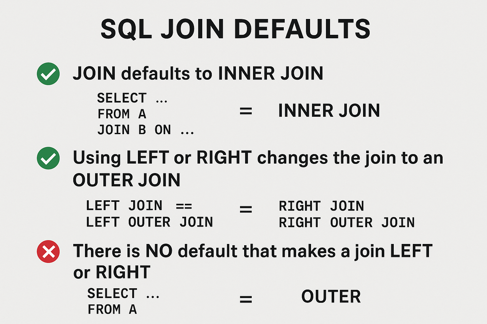

# SQL Notes

# Joins

## Inner vs Outer Join

### **Inner Join**

An **INNER JOIN** returns **only the rows that match in both tables** based on the join condition.
If there’s no match, the row is **not included**.

> Think: **intersection only**.

---

### **Outer Join**

An **OUTER JOIN** returns **all the rows from one or both tables**, even when there is **no match**.
For non-matching rows, the missing side gets filled with **NULLs**.

- **LEFT OUTER JOIN** → all rows from the left table + matches
- **RIGHT OUTER JOIN** → all rows from the right table + matches
- **FULL OUTER JOIN** → all rows from both tables, matched or not

> Think: **everything, plus NULLs where no match exists**.

---

Here are both — a **simple diagram** and a **clear table-based example** you can drop directly into teaching materials.

---

# ✅ **1. Visual Diagram (Text-Based)**

_(Uses circles to show matching vs non-matching rows.)_

```
              INNER JOIN
        +----------------------+
        |      (A ∩ B)         |
A Table |   Only matching       | B Table
        |       rows            |
        +----------------------+

            LEFT OUTER JOIN
   +------------------------------------------+
   |   A All Rows     |   Matching Rows       |
   |  (even if no     |   (A ∩ B)             |
   |    match)        |                       |
   +------------------------------------------+
         NULLs for B where no match exists


            RIGHT OUTER JOIN
   +------------------------------------------+
   |   Matching Rows    |   B All Rows        |
   |      (A ∩ B)       | (even if no match)  |
   +------------------------------------------+
         NULLs for A where no match exists


           FULL OUTER JOIN
   +-----------------------------------------------------+
   |   All Rows from A and B (matches + non-matches)     |
   |   NULLs filled in wherever a match is missing        |
   +-----------------------------------------------------+
```

---

# ✅ **2. Table-Based Example**

### **Table A: Customers**

| customer_id | name  |
| ----------- | ----- |
| 1           | Alice |
| 2           | Bob   |
| 3           | Carol |

### **Table B: Orders**

| order_id | customer_id | item     |
| -------- | ----------- | -------- |
| 201      | 1           | Book     |
| 202      | 1           | Pen      |
| 203      | 4           | Keyboard |

---

## **INNER JOIN: only matching customer rows**

```sql
SELECT *
FROM Customers c
INNER JOIN Orders o
  ON c.customer_id = o.customer_id;
```

### **Result**

| customer_id | name  | order_id | item |
| ----------- | ----- | -------- | ---- |
| 1           | Alice | 201      | Book |
| 1           | Alice | 202      | Pen  |

_mismatched rows (Bob, Carol, order for customer 4) are excluded._

---

## **LEFT OUTER JOIN: all customers + orders if they exist**

```sql
SELECT *
FROM Customers c
LEFT JOIN Orders o
  ON c.customer_id = o.customer_id;
```

### **Result**

| customer_id | name  | order_id | item |
| ----------- | ----- | -------- | ---- |
| 1           | Alice | 201      | Book |
| 1           | Alice | 202      | Pen  |
| 2           | Bob   | NULL     | NULL |
| 3           | Carol | NULL     | NULL |

_Customers with **no orders** still appear — order columns are NULL._

---

## **RIGHT OUTER JOIN: all orders + matching customers**

```sql
SELECT *
FROM Customers c
RIGHT JOIN Orders o
  ON c.customer_id = o.customer_id;
```

### **Result**

| customer_id | name  | order_id | item     |
| ----------- | ----- | -------- | -------- |
| 1           | Alice | 201      | Book     |
| 1           | Alice | 202      | Pen      |
| NULL        | NULL  | 203      | Keyboard |

_Orders with **no matching customer** remain — customer columns are NULL._

---

## **FULL OUTER JOIN: everything**

_(Not supported in MySQL.)_

```sql
SELECT *
FROM Customers c
FULL OUTER JOIN Orders o
  ON c.customer_id = o.customer_id;
```

### **Result**

| customer_id | name  | order_id | item     |
| ----------- | ----- | -------- | -------- |
| 1           | Alice | 201      | Book     |
| 1           | Alice | 202      | Pen      |
| 2           | Bob   | NULL     | NULL     |
| 3           | Carol | NULL     | NULL     |
| NULL        | NULL  | 203      | Keyboard |

---

If you'd like, I can turn this into a **classroom-ready PDF**, a **slide**, or create a **DALL·E diagram** similar to textbook visuals.

# **SQL Join Defaults**

### ✅ **1. `JOIN` defaults to `INNER JOIN`**

If you simply write:

```sql
SELECT …
FROM A
JOIN B ON …
```

…it **automatically means**:

```sql
INNER JOIN
```

You only get rows where the join condition matches in both tables.

---

### ✅ **2. Using `LEFT` or `RIGHT` _changes_ the join to an OUTER JOIN**

As soon as you use **LEFT** or **RIGHT**, SQL switches the join type:

- **LEFT JOIN** = **LEFT OUTER JOIN**
- **RIGHT JOIN** = **RIGHT OUTER JOIN**

These pairs are identical:

```sql
LEFT JOIN     == LEFT OUTER JOIN
RIGHT JOIN    == RIGHT OUTER JOIN
```

In other words:

> **LEFT or RIGHT automatically means OUTER.**
> You never need to write the word OUTER.

---

### 🔍 **3. There is NO default that makes a join LEFT or RIGHT**

You only get LEFT or RIGHT behavior if you explicitly include **LEFT** or **RIGHT**.
If you omit them, SQL always uses INNER.

---

### ❗ Quick Teaching Summary

- **JOIN = INNER JOIN** (default)
- **LEFT JOIN = LEFT OUTER JOIN**
- **RIGHT JOIN = RIGHT OUTER JOIN**
- **FULL OUTER JOIN** must be written explicitly (not supported in MySQL)

A great line to tell students:

> “SQL only assumes inner joins. But if you say LEFT or RIGHT, it automatically becomes an outer join.”

---



## References

- [Visual Explanation of SQL Joins](https://blog.codinghorror.com/a-visual-explanation-of-sql-joins/)
- [SQL Joins Explained in 5 minutes](https://www.acuitytraining.co.uk/news-tips/introduction-sql-joins/)
